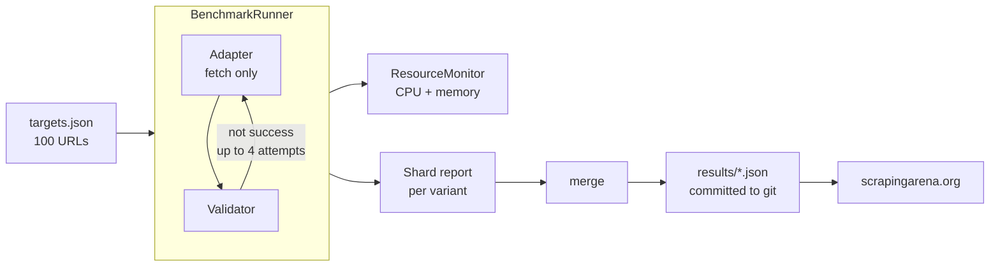

<div align="center">

# ScrapingArena

**An open, reproducible benchmark for web scrapers.**

Every scraper gets the same 100 protected URLs, the same retries, and the same
judge. Results are published as machine-readable JSON, every day, from CI.

[Live leaderboard](https://www.scrapingarena.org) ·
[How it works](docs/architecture.md) ·
[Add a scraper](docs/adding-a-scraper.md) ·
[Contributing](CONTRIBUTING.md)

</div>

---

## What is ScrapingArena?

A benchmark harness. It takes a scraping library, browser, or service, points
it at a fixed corpus of 100 real bot-protected pages, and records whether it
came back with the data. A model decides that, and it never sees which scraper
produced the page.

The setup is meant to be auditable:

- 100 URLs across 100 distinct domains, versioned in git. The corpus file is
  hashed into every report, so you can tell whether two runs are comparable.
- One runner drives every adapter with the same concurrency, timeout, and retry
  budget. Adapters fetch. They do not score themselves.
- One validator decides success for all scrapers using the same rules.
- Every run is committed to this repository. Nothing is overwritten, so
  regressions stay visible.

### How a run works



Each adapter runs in its own CI job and writes its own shard. A final job
merges the shards into one report. If a job fails, only its shard is lost; the
rest of the run still publishes.

### What a scraper is scored on

| Measure | How it is produced |
| --- | --- |
| Success rate | Share of the 100 targets whose final attempt the validator called a success. |
| Speed | Median wall-clock time across successful targets, including engine startup. |
| CPU / memory | Sampled once per second across the process tree, plus the browser container where one is used. |
| Proxy connect failures | Attempts whose error looked like a proxy tunnel or 407 rejection. |

Every scraper is benchmarked twice, once direct and once through a residential
proxy, as two independent variants (`wreq-direct`, `wreq-oxylabs`). Neither
result replaces the other. Resource usage is only measured on direct runs,
since proxy latency would distort the footprint.

## Quick start

Requires Python 3.12+, [uv](https://docs.astral.sh/uv/), and an OpenAI API key
for validation.

```bash
uv sync --all-extras --dev
export OPENAI_API_KEY=...

uv run scrapingarena doctor                              # validate the corpus, no network
uv run scrapingarena scrapers                            # list adapter slugs
uv run scrapingarena benchmark --scraper wreq --limit 5  # 5-target smoke run
uv run pytest
```

Results land in `results/latest.json` and `results/runs/<run-id>.json`.

Raw HTML is not written to disk. It can carry copyrighted content, session
data, and identifiers, so it is dropped after validation.

To run through a proxy, select the provider explicitly. Credentials sitting in
your environment will not change a direct run:

```bash
export OXYLABS_PROXIES_USERNAME=... OXYLABS_PROXIES_PASSWORD=...
uv run scrapingarena benchmark --scraper wreq --proxy oxylabs --limit 5
```

## The scrapers

13 adapters across three families. Slugs are what you pass to `--scraper`.

| Family | Adapters |
| --- | --- |
| HTTP clients | `wreq`, `curl-cffi`, `niquests` |
| Anti-bot browsers | `camoufox-original`, `cloakbrowser`, `fortress`, `patchright`, `shardbrowser` |
| Agent / service browsers | `lightpanda`, `moli`, `obscura`, `steel`, `vercel-agent-browser` |

Per-adapter setup, known constraints, and local run commands are in
[docs/scrapers.md](docs/scrapers.md).

## Repository layout

```text
targets/targets.json              the versioned 100-URL corpus
benchmark-scrapers.json           per-adapter CI runtime matrix
src/scrapingarena/
  runner.py                       concurrency, retries, orchestration
  models.py                       report schema (pydantic)
  settings.py                     proxy + validator configuration
  reporting.py, merging.py        stable JSON reports and aggregation
  resources.py                    CPU/memory sampling
  scrapers/                       one module per adapter
  validation/                     the shared success judge
scripts/benchmark_ci.py           CI setup and execution driver
.github/workflows/                CI checks and the daily benchmark
results/                          published run history
```

## Documentation

| Document | What's in it |
| --- | --- |
| [Architecture](docs/architecture.md) | How the pipeline works end to end: the runner, validation, resources, report schema, and CI. |
| [Adding a scraper](docs/adding-a-scraper.md) | Step-by-step, with a complete worked adapter. |
| [Adding a proxy provider](docs/adding-a-proxy-provider.md) | Wiring a new provider into settings, the matrix, and the workflow. |
| [Scraper catalog](docs/scrapers.md) | Every adapter's setup, constraints, and local run commands. |
| [Target corpus](targets/README.md) | What qualifies as a benchmark target and how to propose one. |
| [Contributing](CONTRIBUTING.md) | Dev setup, required checks, PR expectations. |

## Contributing

Adapters, targets, proxy providers, and bug reports are welcome, including from
vendors benchmarking their own product. Three rules are not negotiable:

1. An adapter fetches. It never decides whether it succeeded. Scoring lives in
   the shared validator.
2. No per-target special-casing. An adapter may not branch on a target's id,
   domain, or URL.
3. Credentials never reach a report, an error message, or the corpus.

Start with [CONTRIBUTING.md](CONTRIBUTING.md), then the guide for whatever
you're adding. Adding an adapter comes to one module, one registry line, one
config entry, and tests using synthetic responses.

## Caveats

- `protection` is a benchmark stratum, not a claim about a vendor. It labels
  what a target was observed to sit behind, and that varies by region, traffic,
  and time.
- No detector is perfect. Block pages change and some legitimate pages are
  thin. If you find a misjudged page, open an issue with the URL and add a
  fixture.
- A score is a snapshot of one corpus, one region, and one day, measured from
  GitHub-hosted runners, which sites treat differently than residential IPs.
- Scheduled runs can be delayed, or disabled by GitHub on inactive public
  repositories. The manual trigger still works.

## License

[MIT](LICENSE).
