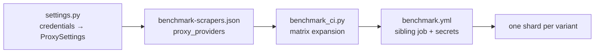

# Adding a proxy provider

Proxy benchmarks are variants, not modes. A direct run is `<scraper>-direct`; a
proxied run is `<scraper>-<provider>`. Each gets its own CI job and its own
shard, so results accumulate side by side instead of overwriting each other.
The useful number is how much a proxy moves a given scraper, and that is only
visible if both runs survive into the report.

The repo currently ships `direct` and `oxylabs`. Adding a third means touching
five places.



## Ground rules

- Never fall back to direct. If a provider is requested and its credentials are
  missing or half-configured, fail loudly. A silent fallback publishes a direct
  result under a proxy label.
- Partial credentials are an error. A username without a password is a
  misconfiguration, not a reason to go direct.
- Credentials never reach a report, in summaries, errors, or metadata.
  `ProxySettings.redact()` handles the error path, so make sure it covers your
  provider's username format.
- Preserve provider-issued credentials verbatim. Many providers encode routing
  (country, session stickiness) into the username. Don't parse, rewrite, or
  normalize it.
- Provider homepage URLs are public metadata and are fine to keep in code.

## 1. Teach `settings.py` about the provider

`configured_proxy()` maps a provider name to credentials from the environment:

```python
def configured_proxy(provider_name: str) -> ProxySettings | None:
    if provider_name == "direct":
        return None
    if provider_name == "newprovider":
        username = os.getenv("NEWPROVIDER_USERNAME")
        password = os.getenv("NEWPROVIDER_PASSWORD")
        if bool(username) != bool(password):
            raise ValueError(
                "NEWPROVIDER_USERNAME and NEWPROVIDER_PASSWORD must be set together"
            )
        if not username or not password:
            raise ValueError("New Provider proxy credentials are not configured")
        return ProxySettings(
            host="proxy.newprovider.com",
            port=8000,
            username=username,
            password=password,
            provider_name="newprovider",
            provider_url="https://newprovider.com/residential-proxies",
        )
    if provider_name != "oxylabs":
        raise ValueError(f"unknown proxy provider: {provider_name}")
    ...
```

`ProxySettings.url` handles percent-escaping of credentials, so usernames and
passwords containing `:`, `@`, or `/` work without special handling.

If your provider's username embeds routing options with its own separators,
extend `redact()` so the base username is scrubbed from errors too. The Oxylabs
branch strips `-cc-` and `-sessid-` suffixes for that reason.

### Keeping the CI driver in sync

`scripts/benchmark_ci.py` has its own `proxy_url()` builder. The duplication is
intentional: the driver runs before `uv sync`, so it cannot import the project
package. Service-backed browsers that take an upstream proxy as a container
environment variable or CLI flag (Obscura, Lightpanda) go through that
function, so add your provider there as well, or those adapters will fail on
your variant.

## 2. Confirm adapters actually support it

Adding a provider to the matrix does not add proxy support to an adapter. An
adapter only uses a proxy if it sets `supports_proxy = True` and passes
`request.proxy` to its client. The runner refuses to start a proxied run for an
adapter that doesn't, rather than quietly producing direct numbers:

```
ValueError: <slug> does not support external proxies
```

All current adapters support external proxies. Two are worth knowing about:

- Steel routes both direct and proxied requests through its self-hosted
  quick-scrape endpoint, passing the provider URL in the `proxyUrl` field.
- Vercel Agent Browser and Moli use an attempt-owned loopback bridge that adds
  Basic auth upstream, keeping credentials out of process arguments.

## 3. Add the provider to the matrix

For each adapter that should run against it:

```json
"proxy_providers": ["direct", "oxylabs", "newprovider"]
```

Always keep `direct`, since it is the control the proxy result is compared
against. Start with two or three adapters rather than all 13, so integration
problems show up on a much shorter CI run.

## 4. Add a sibling workflow job

Each provider gets its own job so GitHub renders it as its own column and a
provider outage doesn't take down the rest of the run. In
`.github/workflows/benchmark.yml`:

**a.** Add a filtered output to `prepare`:

```yaml
    outputs:
      direct: ${{ steps.matrix.outputs.direct }}
      oxylabs: ${{ steps.matrix.outputs.oxylabs }}
      newprovider: ${{ steps.matrix.outputs.newprovider }}
    steps:
      - id: matrix
        run: |
          echo "newprovider=$(python3 scripts/benchmark_ci.py matrix --proxy newprovider)" >> "$GITHUB_OUTPUT"
```

**b.** Copy `benchmark-oxylabs` to `benchmark-newprovider`, point its matrix at
the new output, and set the credential env block:

```yaml
  benchmark-newprovider:
    name: ${{ matrix.scraper.slug }}
    needs: prepare
    strategy:
      fail-fast: false
      matrix:
        scraper: ${{ fromJSON(needs.prepare.outputs.newprovider) }}
    steps:
      ...
      - name: Prepare and run scraper
        env:
          OPENAI_API_KEY: ${{ secrets.OPENAI_API_KEY }}
          NEWPROVIDER_USERNAME: ${{ secrets.NEWPROVIDER_USERNAME }}
          NEWPROVIDER_PASSWORD: ${{ secrets.NEWPROVIDER_PASSWORD }}
```

**c.** Add the job to `aggregate.needs`, or its shards are merged into nothing:

```yaml
  aggregate:
    needs: [benchmark-direct, benchmark-oxylabs, benchmark-newprovider]
```

## 5. Create the secrets

Settings → Secrets and variables → Actions → New repository secret.
Names must match the workflow references exactly.

Never put credentials in `benchmark-scrapers.json`, workflow literals,
committed `.env` files, or reports.

## 6. Test it

Settings tests are required. Cover complete credentials, missing credentials,
partial credentials, an unknown provider name, and escaping of special
characters in the URL. See `tests/test_settings.py`:

```python
def test_newprovider_requires_both_credentials(monkeypatch) -> None:
    monkeypatch.setenv("NEWPROVIDER_USERNAME", "user")
    monkeypatch.delenv("NEWPROVIDER_PASSWORD", raising=False)
    with pytest.raises(ValueError, match="must be set together"):
        configured_proxy("newprovider")
```

Then:

```bash
uv run ruff check . && uv run mypy && uv run pytest
python3 scripts/benchmark_ci.py matrix | python3 -m json.tool

export NEWPROVIDER_USERNAME=... NEWPROVIDER_PASSWORD=... OPENAI_API_KEY=...
uv run scrapingarena benchmark --scraper wreq --proxy newprovider --limit 5
uv run scrapingarena benchmark --scraper wreq --proxy direct --limit 5
```

Run the direct control in the same sitting, since a proxy number is not
interpretable without it.

## Reading the results

`proxy_connect_failures` counts targets where an attempt failed with something
resembling a proxy rejection: `proxyconnect`, `tunnel_connection`, `407`, and
similar. A high count means the provider itself is failing rather than the
scraper being blocked, so check it before drawing conclusions from a low
success rate.

Proxy variants always report `resources: null`, because proxy latency would
otherwise be measured as scraper cost. Compare footprints on direct runs.
