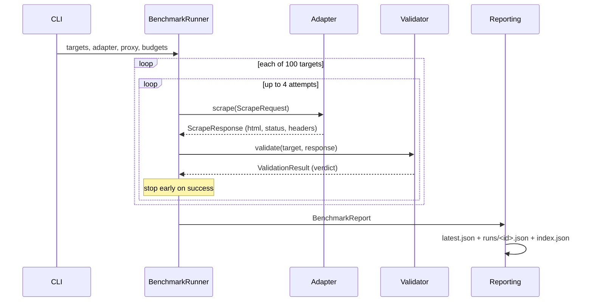
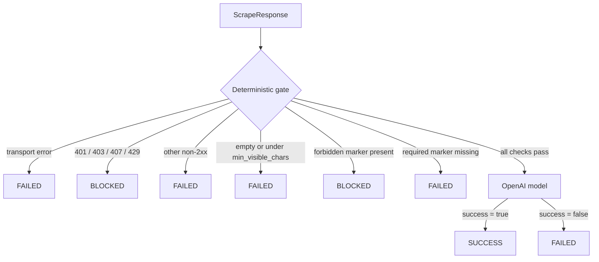

# How ScrapingArena works

This document covers the benchmark end to end: what runs, in what order, what
decides success, and what gets published. If you are adding an adapter, read
[Adding a scraper](adding-a-scraper.md) next.

## The core separation

One rule shapes the codebase:

> Adapters fetch. The runner orchestrates. The validator scores.

An adapter's only job is to turn a URL into a normalized `ScrapeResponse`. It
does not retry, classify its own output, write reports, or know what a good
page looks like. That all lives in shared code, so every scraper is measured by
the same rules, and a vendor can contribute an adapter for their own product
without being able to affect its score.

## Pipeline



### 1. Targets

[`targets/targets.json`](../targets/targets.json) is the single source of
truth. `load_targets()` parses it into `Target` models and enforces the corpus
invariants in [`targets.py`](../src/scrapingarena/targets.py):

- exactly 100 entries, with unique ids and unique domains;
- no `protection: none`, since every canonical target sits behind something;
- no news or publishing categories;
- deep routes only, never bare homepages.

The file's SHA-256 is recorded in every report as `target_set_sha256`. Two
reports are only comparable when that hash matches.

To validate without touching the network:

```bash
uv run scrapingarena doctor
```

### 2. The runner

[`runner.py`](../src/scrapingarena/runner.py) drives everything. Per target it
makes up to 4 attempts (`retries=3` by default) and stops as soon as a verdict
is `success`.

**Concurrency.** All published configurations use `concurrency: 1`, and the
runner has a separate path for that case. Instead of building a fresh adapter
per attempt, it constructs one configured session instance and reuses it for
the whole corpus. This was added for a specific reason: repeatedly creating
remote browser sessions exhausted Steel's local API and turned nearly every
proxied target into a connection error rather than a real result. Above
concurrency 1, each attempt gets its own adapter instance behind a semaphore.

**Timing.** Duration is measured by the runner as end-to-end wall-clock time,
including process spawn, profile creation, and context setup, rather than by
the adapter's own timer. Adapter-local timers only measured navigation, which
made browsers look artificially cheap to start.

**Failure handling.** An adapter that raises is caught and recorded as a failed
attempt with the exception type and message. When a proxy is configured, that
message goes through `ProxySettings.redact()` before it can reach a report.

### 3. Validation

This part is often misread, so it is worth being precise: the validator has two
stages, not one.



Stage one is cheap and deterministic, and decides most cases on its own:
transport errors, blocking status codes, empty pages, and the target's own
`required_markers`, `forbidden_markers`, and `min_visible_chars`.

Stage two only runs for responses that survive the gate. The model receives
filtered evidence, being a safe subset of headers plus bounded samples of raw
HTML and extracted visible text, and answers one question: does this page
actually contain the useful data the URL promised? Branding, navigation, cookie
dialogs, empty app shells, login walls, and CAPTCHAs do not count as success,
even with HTTP 200. Page content is treated as untrusted evidence, and the
prompt instructs the model not to follow instructions found inside it.

Configuration lives in `settings.py`:

| Variable | Purpose | Default |
| --- | --- | --- |
| `OPENAI_API_KEY` | Required. Benchmarks refuse to start without it. | none |
| `SCRAPINGARENA_OPENAI_MODEL` | Model used for stage two. | `gpt-5.6-luna` |

The validator stamps its name (`openai-content-v3`) into every result. That
string is versioned on purpose: when scoring semantics change, it changes too,
so results produced under different policies stay distinguishable rather than
silently mixed.

`Verdict` also defines `AMBIGUOUS`, which the current validator never emits. It
exists for future validators, so treat it as reserved.

### 4. Resource measurement

[`resources.py`](../src/scrapingarena/resources.py) samples once per second
while a benchmark runs, covering the full process tree, which is how native
runtimes spawned as children (Moli, agent-browser) get captured automatically.
When a browser service runs in Docker, `SCRAPINGARENA_RESOURCE_CONTAINER` adds
that container's usage to the same series.

Each summary stores peak and average memory (MiB), peak and average CPU
(cores), duration, and the full sample series.

Direct variants only. Proxy runs set `resources` to `null`, because proxy
latency inflates wall-clock time and would turn the scraper's footprint into a
measurement of somebody's network.

### 5. Reports

`write_report()` writes three files atomically:

| File | Contents | Why |
| --- | --- | --- |
| `results/latest.json` | The newest full report. | Stable URL. |
| `results/runs/<run-id>.json` | Immutable per-run history. | Never overwritten. |
| `results/index.json` | All runs, summaries only. | Sample arrays stripped to keep the daily index small. |

Current schema is version 3:

```jsonc
{
  "schema_version": 3,
  "metadata": { "run_id", "started_at", "finished_at", "git_sha",
                "runner", "target_set_sha256" },
  "summaries": [{
    "benchmark": "wreq-oxylabs",   // the variant
    "scraper": "wreq",             // adapter alone
    "proxy_provider": "oxylabs",   // null when direct
    "total": 100, "success": 21, "blocked": 0, "failed": 79, "ambiguous": 0,
    "success_rate": 21.0,
    "proxy_connect_failures": 0,
    "median_success_ms": 2310.0,   // final successful attempt
    "median_total_ms": 2310.0,     // all attempts summed
    "resources": null              // null for proxy variants
  }],
  "results": { "wreq-oxylabs": [ /* per-target attempts */ ] }
}
```

Some things are left out on purpose. `ScrapeResponse.html` and `.headers` are
declared `exclude=True` on the model, so raw page content and response headers
are used during validation and then dropped; they are never serialized. Neither
are proxy credentials or authenticated proxy URLs. Provider homepage URLs are
public metadata and are fine to keep.

### 6. Sharding and merging

Running 26 variants in one process would be slow and fragile, so CI gives each
variant its own job writing to `shard-results/<variant>/`. A final job
downloads every shard and merges them:

```bash
uv run scrapingarena merge downloaded-shards/*/latest.json \
  --run-id "$RUN_ID" --output-dir results
```

A crashed job costs one shard, and the rest of the run still publishes.

The same thing works locally:

```bash
uv run scrapingarena benchmark --scraper wreq --output-dir shard-results/wreq
uv run scrapingarena benchmark --scraper curl-cffi --output-dir shard-results/curl-cffi
uv run scrapingarena merge shard-results/*/latest.json --run-id local --output-dir results
```

## Benchmark variants

A variant is one scraper paired with one proxy mode, named
`<scraper>-<provider>`; direct runs are `<scraper>-direct`. Each is an
independent job producing an independent shard, so a proxied result never
replaces a direct one. They are two measurements, not two attempts at one.

`benchmark-scrapers.json` declares each adapter's runtime needs, and
`scripts/benchmark_ci.py matrix` expands `proxy_providers` into the job list:

```bash
python3 scripts/benchmark_ci.py matrix | python3 -m json.tool
python3 scripts/benchmark_ci.py matrix --proxy oxylabs   # one provider's jobs
```

Every config entry declares:

| Field | Purpose |
| --- | --- |
| `slug` | Adapter slug; must match the registry. |
| `install_command` | Dependency install (CI appends `--extra openai`). |
| `benchmark_command` | Base command; the driver appends proxy, concurrency, retries, output dir. |
| `cache_paths` | Directories cached between runs, for downloaded runtimes. |
| `setup_commands` | Runtime downloads, system packages. |
| `service_commands` | `docker run` lines for service-backed browsers. |
| `health_url` | Probed until ready; required whenever `service_commands` is set. |
| `proxy_providers` | Which variants to generate. Must include `direct`. |
| `concurrency` | Positive integer passed to the runner. |

`tests/test_registry.py` checks that this file and the registry stay in sync,
so a missing entry fails CI instead of silently dropping a scraper.

## Continuous integration

`ci.yml` runs on every PR and push to main: ruff lint, ruff format check, mypy
(strict), pytest, and `doctor`. It also runs offline smoke checks for the
native browser adapters against local fixtures.

`benchmark.yml` runs daily at 05:17 UTC and on manual dispatch:

1. **prepare** builds the direct and proxied job matrices.
2. **benchmark-direct** and **benchmark-oxylabs** run one job per variant, up to
   9 in parallel, each uploading its shard as an artifact.
3. **aggregate** merges all shards, then commits `results/` back to the branch
   with `[skip ci]`.

A dispatch with a `limit` input runs a smoke benchmark that uploads artifacts
without committing. The workflow needs `contents: write`, plus the
`OPENAI_API_KEY` and proxy credential secrets.

Git history is the durable public result store. Artifacts are the debugging
copy. The frontend reads the committed JSON straight from GitHub, with no
database or API server in between.

## Where things live

| Concern | Module |
| --- | --- |
| Report schema | [`models.py`](../src/scrapingarena/models.py) |
| Orchestration, retries | [`runner.py`](../src/scrapingarena/runner.py) |
| Scoring | [`validation/`](../src/scrapingarena/validation/) |
| Proxy + validator config | [`settings.py`](../src/scrapingarena/settings.py) |
| Adapter contract | [`scrapers/base.py`](../src/scrapingarena/scrapers/base.py) |
| Adapter lookup | [`scrapers/registry.py`](../src/scrapingarena/scrapers/registry.py) |
| Report writing | [`reporting.py`](../src/scrapingarena/reporting.py) |
| Shard merging | [`merging.py`](../src/scrapingarena/merging.py) |
| CPU/memory sampling | [`resources.py`](../src/scrapingarena/resources.py) |
| CI driver | [`scripts/benchmark_ci.py`](../scripts/benchmark_ci.py) |
